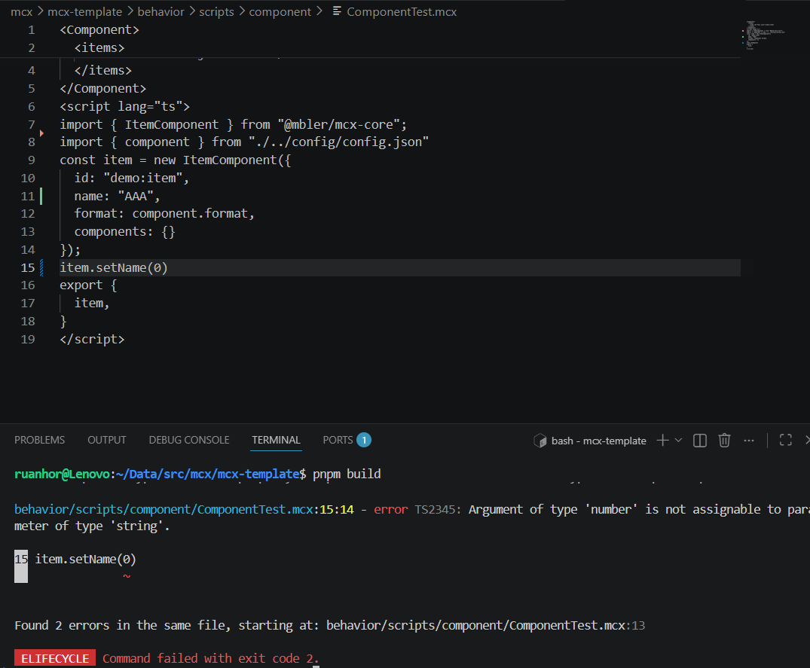

## 演示
OK啊，经过少部分源码阅读和codex交流，初步写出了mcx-tsc
就是这么个效果，能精准识别类型和映射行号，相当强了。  

## 使用
MCX DSL还在开发，现在用...不乏有问题的，用的话先clone仓库
[mcx-template - mcx template](https://github.com/RuanhoR/mcx-template)  
然后，装Nodejs依赖，全局安装mbler
```bash
pnpm i -g mbler@0.2.3-alpha.r1
```
然后，`pnpm build` 就行了
## 原理
内部用到了一个库，这个库vuejs也在用，当作ts类型检查，它就是 [Volar](https://volarjs.dev)。  
它能做些什么呢？
 - 能让你的自定义语言支持tsc检查
 - 把错误的行数映射到正确的行数/列数
 - 代理TS

具体用法呢，有两个方向可以用
 - 直接用Vue封装过的
 - 用volar的api  

这两难度区别不算大，都需要你写mapping等等，然后你还需要考虑ide更新代码后（需要编译缓存，增量更新）等等  
虽然mcx的语言插件实现并不大，就一千多行，但每一行都很难写。  